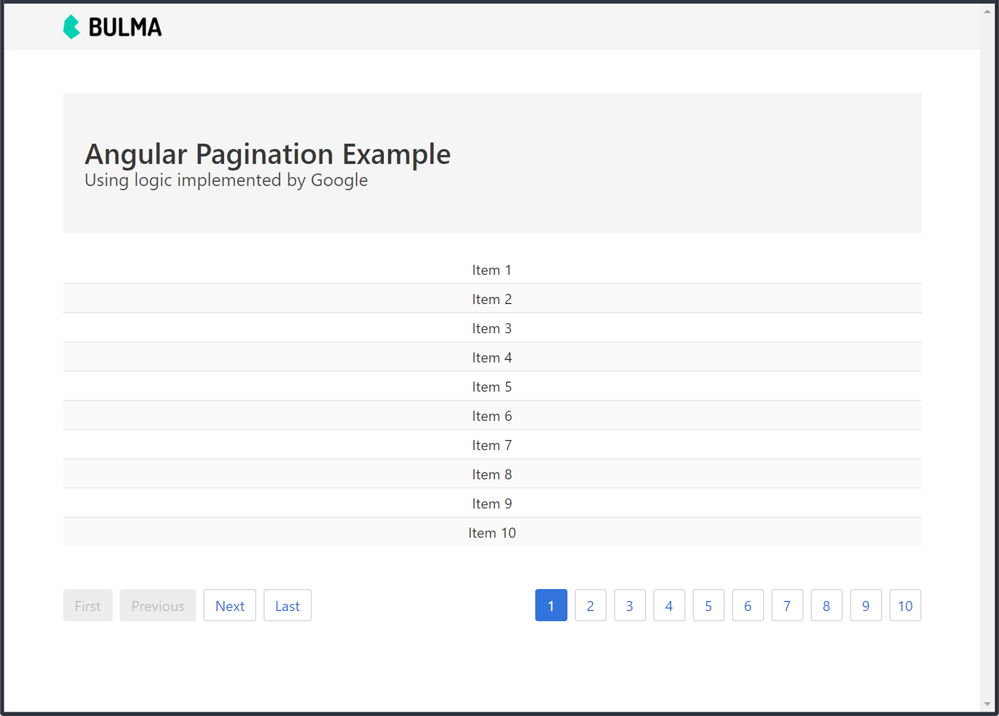

# Angular Pagination Example
This project shows how to implement pagination in Angular as shown in the article [Angular 2/5 - Pagination Example with Logic like Google](http://jasonwatmore.com/post/2016/08/23/angular-2-pagination-example-with-logic-like-google) by *Jason Watmore*.

     
    <a href="https://angularpagination.firebaseapp.com/" target="_blank">Angular Pagination Example</a>

## Software Used
* Angular CLI v1.6.3
* Angular v5.1.3
* [Bulma CSS Framework](https://bulma.io/)

## Installation
1. Clone this repo `git clone https://github.com/Stanza987/angular-pagination.git`
1. `cd` into the folder of the cloned repo
1. Run `yarn install` to install dependencies
1. Run `ng serve`, and navigate to `http://localhost:4200/`
